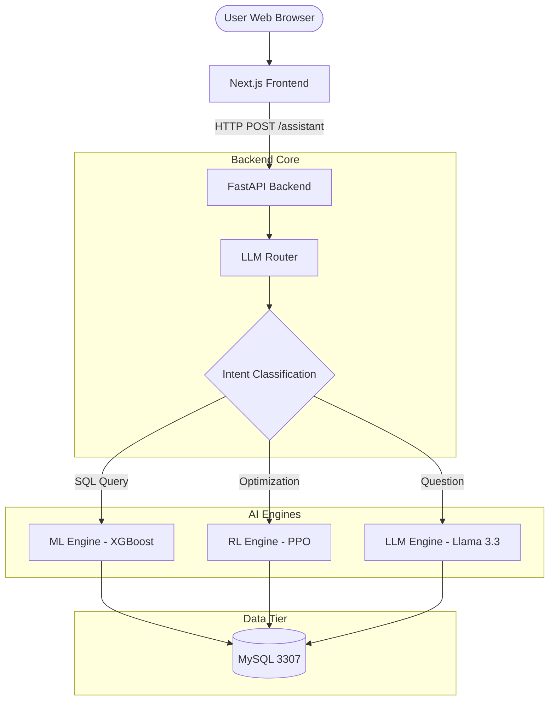

# 🧠 SADOP - Smart AI-Driven Database Optimization Platform

<div align="center">


<h1> Rahmoun Rayan Abderrahime </h1>

**An intelligent database performance optimization system combining Machine Learning, Reinforcement Learning, and Large Language Models**

</div>
## 🏗 Project Architecture

This project is organized into a modular, professional structure:

- **`backend/`**: The Core logic.
  - `src/core/`: Database connections, routing logic, and intelligent endpoints.
  - `src/engines/`: ML performance prediction, RL index recommendation, and LLM synthesis.
- **`frontend/`**: Next.js 15 web interface for user interaction.
- **`research/`**: AI development hub.
  - `notebooks/`: Data science experiments and model training processes.
  - `ml/`: Pre-trained XGBoost performance models and datasets.
  - `rl/`: PPO agents and custom database environments.
- **`docs/`**: Centralized documentation.
  - `reports/`: Academic and professional project reports.
  - `explanations/`: Deep dives into specific architectural components.
  - `professor/`: Evaluation-specific answers and documentation.
- **`data/`**: Training datasets and system logs.
- **`scripts/`**: Maintenance and utility scripts.

## <div align="center">

---

[](https://www.python.org/)
[](https://www.mysql.org/)
[](https://fastapi.tiangolo.com/)
[](https://nextjs.org/)
[]()

**[Overview](#-project-overview) • [Features](#-key-features) • [Architecture](#-system-architecture) • [Installation](#-installation) • [Usage](#-usage) • [Documentation](#-comprehensive-file-documentation)**

</div>

---

## 📋 Table of Contents

- [Project Overview](#-project-overview)
- [Key Features](#-key-features)
- [System Architecture](#-system-architecture)
- [Tech Stack](#-tech-stack)
- [Installation](#-installation)
- [Usage](#-usage)
- [Comprehensive File Documentation](#-comprehensive-file-documentation)
  - [Backend Core](#backend-core-detailed)
  - [AI Engines](#ai-engines-detailed)
  - [Research Hub](#research-hub-detailed)
  - [Frontend Interface](#frontend-interface-detailed)
- [Performance Metrics](#-performance-metrics)
- [API Reference](#-api-reference)
- [Contributing](#-contributing)

---

## 🧠 Project Overview

**SADOP (Smart AI-Driven Database Optimization Platform)** is an academic project that demonstrates the integration of:

- **Machine Learning** for query performance prediction (XGBoost classifier, 95% accuracy)
- **Reinforcement Learning** for intelligent index recommendations (PPO agent)
- **Large Language Models** for natural language interaction (Llama 3.3 70B via Groq)
- **Real-time Database Monitoring** with automated optimization suggestions

### The Problem

Database administrators face challenges:

- Manual query optimization is time-consuming
- Index selection requires deep expertise
- Performance degradation is often reactive, not proactive

### The Solution

SADOP provides:

1.  **Automated query performance prediction** - Identifies slow queries before they impact production
2.  **Intelligent index recommendations** - RL agent learns optimal indexing strategies
3.  **Natural language interface** - Ask questions in plain English, get actionable SQL recommendations

---

## ⭐ Key Features

### 🎯 Core Capabilities

- **ML-Powered Diagnostics**: Predicts whether a query will be FAST or SLOW with 95% accuracy
- **RL-Driven Optimization**: Recommends CREATE INDEX statements based on workload analysis
- **LLM Query Generation**: Generates optimized SQL from natural language requests
- **Intelligent Routing**: Automatically classifies user intent and routes to appropriate tools
- **Full-Stack Web UI**: Modern Next.js interface with real-time analysis

### 🔧 Technical Highlights

- **Hybrid AI Architecture**: Combines symbolic AI (rules), ML (predictions), and RL (optimization)
- **Workload-Based RL**: Agent trained on 100k timesteps using simulated database environment
- **Feature Engineering**: 10 ML features extracted from SQL structure + EXPLAIN plans
- **Cost-Aware Optimization**: Balances query performance gains vs index maintenance costs

---

## 🏗️ System Architecture



### Data Flow Example

**User asks: "best query to get users from Algeria with their transactions"**

```
1. Frontend → POST /assistant {"message": "..."}
2. main.py → llm_router.classify_prompt()
   Result: {"type": "query_generation"}
3. main.py → llm_engine.generate_query_variations()
   Generates: SELECT u.*, t.* FROM user u JOIN transactions t ...
4. main.py → ml_engine.predict_query_performance()
   Result: {"is_slow": False, "probability": 0.12}
5. main.py → rl_engine.recommend_indexes_for_query()
   Result: ["CREATE INDEX idx_user_country ON user(country);", ...]
6. main.py → llm_engine.synthesize_response()
   Result: Natural language summary with SQL and recommendations
7. Frontend ← JSON response with formatted markdown
```

---

## 🛠️ Tech Stack

### Backend

- **Python 3.12** - Core language
- **FastAPI** - High-performance REST API
- **MySQL Connector** - Database interaction
- **XGBoost** - ML classification model
- **Stable-Baselines3** - RL (PPO algorithm)
- **Gymnasium** - RL environment framework
- **Groq SDK** - LLM API integration (Llama 3.3 70B)

### Frontend

- **Next.js 15** - React framework
- **TypeScript** - Type-safe JavaScript
- **TailwindCSS** - Utility-first styling
- **React Hooks** - State management

### Data & ML

- **Pandas/NumPy** - Data manipulation
- **Scikit-Learn** - ML utilities & preprocessing
- **Matplotlib/Seaborn** - Visualizations
- **Jupyter Notebooks** - Interactive development

### Database

- **MySQL 8.0** - Relational database
- **MySQL Workbench** - Database management

---

## 📦 Installation

### Prerequisites

```bash
# System requirements
- Python 3.12+
- Node.js 18+
- MySQL 8.0+
- Conda (recommended)
```

### Step 1: Clone Repository

```bash
git clone https://github.com/your-username/SADOP.git
cd SADOP
```

### Step 2: Backend Setup

```bash
# Create conda environment
conda create -n sadop python=3.12
conda activate sadop

# Install dependencies
cd backend
pip install -r requirements.txt

# Set environment variables
# Add your GROQ_API_KEY to the .env file
```

### Step 3: Database Setup

```bash
# Start MySQL on port 3307
mysql -u root -p

# Create database and user
CREATE DATABASE SADOP_BDD;
CREATE USER 'sadop_user'@'localhost' IDENTIFIED BY '1234';
GRANT ALL PRIVILEGES ON SADOP_BDD.* TO 'sadop_user'@'localhost';
FLUSH PRIVILEGES;

# Load schema and data from docs/db/
```

### Step 4: Frontend Setup

```bash
cd ../frontend
npm install
```

### Step 5: Verify Installation

```bash
# Test backend
cd ../BackEnd
python verify_backend.py

# Expected output:
# ✅ ML Model loaded successfully
# ✅ RL Model loaded successfully
# ✅ Database connection OK
```

---

## 🚀 Usage

### Start the Application

**Terminal 1 - Backend:**

```bash
cd backend
uvicorn main:app --reload
# Server running on http://localhost:8000
```

**Terminal 2 - Frontend:**

```bash
cd frontend
npm run dev
# App running on http://localhost:3000
```

### Example Queries

**1. SQL Diagnosis**

```
User: SELECT * FROM user WHERE country = 'Algeria'

Response:
🎯 Verdict: FAST ✅
📊 ML Prediction: 95% confidence (fast query)
🎯 RL Recommendations:
  - CREATE INDEX idx_user_country ON user(country);
```

**2. Natural Language Query Generation**

```
User: best query to get users with total account balance

Response:
✅ Generated Query:
SELECT u.user_id, u.full_name, SUM(a.balance) as total_balance
FROM user u
JOIN accounts a ON u.user_id = a.user_id
GROUP BY u.user_id, u.full_name

🎯 Recommended Indexes:
  - CREATE INDEX idx_user_user_id ON user(user_id);
  - CREATE INDEX idx_accounts_user_id ON accounts(user_id);
```

**3. General Question**

```
User: Why is my database slow?

Response:
Your database may be slow due to:
1. Missing indexes on frequently queried columns
2. Full table scans without WHERE clauses
3. Unoptimized JOIN operations

💡 Use my diagnostic tool by sharing a specific SQL query!
```

---

## 📚 Comprehensive File Documentation

### Project Tree (Current Structure)

```text
SADOP/
├── .gitignore
├── backdate_commits_fixed.ps1
├── test_git.ps1
├── hero.jpg
├── SADOP.jpg
├── ReadME.MD
├── scripts/
│   └── verify_backend.py
├── backend/
│   ├── main.py
│   └── src/
│       ├── core/
│       │   ├── database.py
│       │   └── llm_router.py
│       └── engines/
│           ├── llm_engine.py
│           ├── ml_engine.py
│           └── rl_engine.py
├── frontend/
│   ├── app/
│   │   ├── favicon.ico
│   │   ├── globals.css
│   │   ├── layout.tsx
│   │   └── page.tsx
│   ├── components/
│   │   └── README.md
│   ├── hooks/
│   │   └── README.md
│   ├── lib/
│   │   └── README.md
│   ├── public/
│   │   ├── file.svg
│   │   ├── globe.svg
│   │   ├── next.svg
│   │   ├── vercel.svg
│   │   └── window.svg
│   ├── types/
│   │   └── README.md
│   ├── FRONTEND_UPDATE.md
│   ├── README.md
│   ├── .gitignore
│   ├── eslint.config.mjs
│   ├── next.config.ts
│   ├── package.json
│   ├── package-lock.json
│   ├── postcss.config.mjs
│   └── tsconfig.json
├── data/
│   ├── accounts.csv
│   ├── users.csv
│   ├── transactions.csv
│   ├── logs.csv
│   ├── generated_queries.csv
│   ├── ml_features.csv
│   ├── ml_features_clean.csv
│   ├── slow_query_metrics.csv
│   ├── slow_query_metrics_filtered.csv
│   ├── slow_query_metrics-Copy1.csv
│   ├── query_execution_features.csv
│   ├── rl_decision_log.csv
│   ├── X_train.csv
│   ├── X_test.csv
│   ├── y_train_cls.csv
│   ├── y_test_cls.csv
│   ├── y_train_reg.csv
│   └── y_test_reg.csv
├── docs/
│   ├── explanations/
│   │   ├── ML_DISPLAY_TEST.md
│   │   ├── QUERY_GEN_ERROR_FIX.md
│   │   ├── ReadME2.MD
│   │   ├── RL_INTEGRATION.md
│   │   ├── rl_readme.md
│   │   └── ROUTING_EXPLANATION.md
│   ├── professor/
│   │   ├── PROFESSOR_ANSWERS.md
│   │   └── PROFESSOR_FINAL_ANSWERS.md
│   └── reports/
│       └── Projet-Homework.pdf
├── research/
│   ├── ml/
│   │   ├── 1_Data Pipeline for AI .ipynb
│   │   ├── 2_exploratory_analysis.ipynb
│   │   ├── 3_Normalize_Numeric_Features _Train_Test Split.ipynb
│   │   ├── 4_Verify Data Quality & Consistency.ipynb
│   │   ├── 5_ML Diagnostic Engine — Predicting Query Performance.ipynb
│   │   ├── models/
│   │   │   ├── logistic_regression_reference.pkl
│   │   │   ├── random_forest_reference.pkl
│   │   │   ├── scaler.pkl
│   │   │   ├── xgboost_slow_query_model.pkl
│   │   │   └── xgboost_slow_query_model.json
│   │   └── text.txt
│   ├── notebooks/
│   │   ├── 00_rl_index_optimization_agent.ipynb
│   │   ├── 01_environment_check.ipynb
│   │   ├── 02_mysql_connection.ipynb
│   │   ├── 03_generate_fake_data.ipynb
│   │   ├── 04_load_csv_into_mysql.ipynb
│   │   ├── 05_MySQL_Monitoring_Setup.ipynb
│   │   ├── 06_Enable_Performance_Schema.ipynb
│   │   ├── 07_Capture Performance Metrics.ipynb
│   │   ├── 08_Generate Realistic Slow Queries and Metrics.ipynb
│   │   └── 09_Execution_Plan_and_Performance_Features.ipynb.ipynb
│   └── rl/
│       ├── envs.py
│       ├── train.py
│       ├── logs/
│       │   └── monitor.csv
│       ├── Models/
│       │   ├── best_model.zip
│       │   ├── env_metadata.json
│       │   ├── ppo_index_optimizer.zip
│       │   └── ppo_sadop_final.zip
│       ├── tensorboard/
│       │   ├── PPO_1/  (TensorBoard run logs)
│       │   ├── PPO_2/
│       │   ├── PPO_3/
│       │   ├── PPO_4/
│       │   ├── PPO_5/
│       │   ├── PPO_6/
│       │   ├── PPO_7/
│       │   ├── PPO_8/
│       │   ├── PPO_9/
│       │   ├── PPO_10/
│       │   └── PPO_11/
│       └── tensorboard_archive/
│           ├── PPO_1/
│           └── PPO_2/
└── (Git metadata and IDE config files omitted)
```

### Backend Core (Detailed)

#### 🔹 `backend/main.py`

**Purpose:** Central FastAPI application and orchestration layer.

#### 🔹 `backend/src/core/database.py`

**Purpose:** MySQL connection management and schema utilities.

#### 🔹 `backend/src/core/llm_router.py`

**Purpose:** Intelligent classification of user intent using LLM.

### AI Engines (Detailed)

#### 🔹 `backend/src/engines/ml_engine.py`

**Purpose:** XGBoost performance prediction engine (95% accuracy).

#### 🔹 `backend/src/engines/rl_engine.py`

**Purpose:** PPO-based index recommendation agent.

#### 🔹 `backend/src/engines/llm_engine.py`

**Purpose:** Natural language synthesis and SQL generation.

### Research Hub (Detailed)

#### 🔹 `research/notebooks/`

Contains the complete development cycle of the AI models, from data ingestion to evaluation.

#### 🔹 `research/ml/models/`

Storage for pre-trained XGBoost models.

#### 🔹 `research/rl/Models/`

Storage for trained PPO agents and environments.

### Frontend Interface (Detailed)

#### 🔹 `frontend/app/page.tsx`

**Purpose:** Main React component providing chat-based interface for SQL analysis and query generation.

**Component Structure:**

````typescript
export default function Home() {
  // State management
  const [messages, setMessages] = useState<Message[]>([]);
  const [input, setInput] = useState("");
  const [loading, setLoading] = useState(false);

  // API call handler
  const handleSend = async () => {
    const response = await fetch("http://localhost:8000/assistant", {
      method: "POST",
      headers: {"Content-Type": "application/json"},
      body: JSON.stringify({message: input})
    });

    const data = await response.json();
    setMessages([...messages, {role: "assistant", content: data.diagnosis}]);
  };

  // Markdown formatting
  const formatResponse = (text: string) => {
    // Handle **bold** text
    // Handle ```sql code blocks
    // Render in terminal-style dark box
  };

  return (
    <div className="chat-container">
      {/* Messages display */}
      {/* Input field */}
      {/* Send button */}
    </div>
  );
}
````

**Key Features:**

1.  **Markdown Rendering (Lines 8-70):**

    ````typescript
    function formatTextWithBold(text: string) {
      const parts = text.split(/(\*\*.*?\*\*)/g);
      return parts.map((part, i) => {
        if (part.startsWith("**") && part.endsWith("**")) {
          return <strong key={i}>{part.slice(2, -2)}</strong>;
        }
        return part;
      });
    }

    function formatResponse(text: string) {
      // Extract SQL code blocks
      const codeBlockRegex = /```sql\n([\s\S]*?)```/g;

      // Render in dark terminal box with cyan text
      return (
        <div className="terminal-box">
          <code className="sql-code">{sqlContent}</code>
        </div>
      );
    }
    ````

2.  **API Integration (Lines 95-120):**

    ```typescript
    const response = await fetch("http://localhost:8000/assistant", {
      method: "POST",
      headers: { "Content-Type": "application/json" },
      body: JSON.stringify({ message: userInput }),
    });

    const data = await response.json();
    ```

3.  **UI Styling:**
    - **Chat bubbles**: User (right), Assistant (left)
    - **SQL code blocks**: Dark background, cyan text, monospace font
    - **Bold text**: `**text**` rendered as `<strong>`
    - **Loading state**: "Thinking..." indicator

**Dependencies:**

- React 18
- Next.js 15
- TailwindCSS (utility classes)

---

         return <strong key={i}>{part.slice(2, -2)}</strong>;

       return part;

function formatResponse(text: string) {
// Extract SQL code blocks
const codeBlockRegex = /`sql\n([\s\S]*?)`/g;

     // Render in dark terminal box with cyan text
     return (
       <div className="terminal-box">
         <code className="sql-code">{sqlContent}</code>
       </div>
     );

}

2. **API Integration (Lines 95-120):**

```typescript
const response = await fetch("http://localhost:8000/assistant", {
  method: "POST",
  headers: { "Content-Type": "application/json" },
  body: JSON.stringify({ message: userInput }),
});

const data = await response.json();
```

3. **UI Styling:**

- **Chat bubbles**: User (right), Assistant (left)
- **SQL code blocks**: Dark background, cyan text, monospace font
- **Bold text**: `**text**` rendered as `<strong>`
- **Loading state**: "Thinking..." indicator

**Dependencies:**

- React 18
- Next.js 15
- TailwindCSS (utility classes)

---

### RL Files (Detailed)

#### 🔹 `RL/envs.py` (6,121 bytes)

**Purpose:** Gymnasium-based RL environment simulating database indexing decisions.

**Environment Design:**

```python
class DatabaseIndexEnv(gym.Env):
 """
 Simulated database environment for RL training

 Observation Space:
   - indexes: MultiBinary(20) - Binary vector, 1=index exists
   - workload: Box(0, 1, (20,)) - Float vector, query intensity

 Action Space:
   - Discrete(21) - Actions 0-20
   - Action 0: STOP
   - Actions 1-20: Toggle index on column X

 Reward Function:
   R = (prev_cost - current_cost) - penalty + stability_bonus
 """

 def __init__(self):
     # Lines 43-55: Define spaces
     self.observation_space = spaces.Dict({
         "indexes": spaces.MultiBinary(NUM_COLUMNS),
         "workload": spaces.Box(0.0, 1.0, (NUM_COLUMNS,), dtype=np.float32)
     })
     self.action_space = spaces.Discrete(NUM_COLUMNS + 1)

     self.current_indexes = np.zeros(NUM_COLUMNS, dtype=np.int8)
     self.current_workload = np.zeros(NUM_COLUMNS, dtype=np.float32)

 def reset(self):
     """Lines 57-75: Reset environment"""
     self.current_indexes = np.zeros(NUM_COLUMNS)

     # Generate realistic workload (exponential distribution)
     self.current_workload = np.random.exponential(0.2, NUM_COLUMNS)
     self.current_workload = np.clip(self.current_workload, 0.0, 1.0)

     # Create 3-5 "hot" columns
     num_hot = np.random.randint(3, 6)
     hot_indices = np.random.choice(NUM_COLUMNS, num_hot, replace=False)
     self.current_workload[hot_indices] = np.random.uniform(0.7, 1.0, num_hot)

     return self._get_obs(), {}

 def step(self, action):
     """Lines 114-154: Execute action and return reward"""
     prev_cost = self._calculate_total_cost(self.current_indexes)

     penalty = 0.0
     if action > 0:
         col_idx = action - 1
         if self.current_indexes[col_idx] == 0:
             # CREATE INDEX
             self.current_indexes[col_idx] = 1
             penalty = INDEX_CREATION_PENALTY  # 50.0
         else:
             # DROP INDEX
             self.current_indexes[col_idx] = 0
             penalty = DROP_INDEX_PENALTY  # 100.0

     current_cost = self._calculate_total_cost(self.current_indexes)

     # Reward formula (LINE 147)
     improvement = prev_cost - current_cost
     stability_bonus = 10.0 if action == 0 else 0.0
     reward = improvement - penalty + stability_bonus

     return self._get_obs(), reward, terminated, truncated, {}
```

**Cost Model (Lines 84-112):**

```python
def _calculate_total_cost(self, indexes):
 """Simulate database query cost"""
 total_cost = 0.0

 for i in range(NUM_COLUMNS):
     if indexes[i] == 1:
         # Index seek: O(log N)
         access_cost = np.log2(TABLE_SIZE) * SEEK_COST_PER_ROW
     else:
         # Full scan: O(N)
         access_cost = TABLE_SIZE * SCAN_COST_PER_ROW

     # Weight by workload intensity
     query_cost = self.current_workload[i] * access_cost
     total_cost += query_cost

     # Add maintenance cost
     if indexes[i] == 1:
         total_cost += INDEX_MAINTENANCE_COST

 return total_cost
```

**Constants:**

- **TABLE_SIZE**: 20,000 rows (simulated)
- **SCAN_COST_PER_ROW**: 1.0
- **SEEK_COST_PER_ROW**: 0.1 (10× faster with index)
- **INDEX_CREATION_PENALTY**: 50.0
- **DROP_INDEX_PENALTY**: 100.0 (prevents flickering)

---

#### 🔹 `RL/train.py` (5,580 bytes)

**Purpose:** PPO agent training script with evaluation callbacks.

**Training Configuration:**

```python
# Lines 76-91: PPO Hyperparameters
model = PPO(
 "MultiInputPolicy",  # Required for Dict observation space
 env,
 learning_rate=3e-4,
 n_steps=2048,        # Steps per policy update
 batch_size=64,
 gamma=0.99,          # Discount factor
 gae_lambda=0.95,     # Generalized Advantage Estimation
 clip_range=0.2,      # PPO clipping (prevents large policy updates)
 ent_coef=0.01,       # Entropy coefficient (encourages exploration)
 vf_coef=0.5,         # Value function coefficient
 max_grad_norm=0.5,   # Gradient clipping
 verbose=1,
 tensorboard_log="./tensorboard"
)

# Lines 97-101: Training
model.learn(
 total_timesteps=100_000,  # 100k training steps
 callback=EvaluationCallback(eval_freq=5000),
 progress_bar=True
)
```

**Evaluation Callback (Lines 28-60):**

```python
class EvaluationCallback(BaseCallback):
 """Periodic evaluation during training"""

 def _on_step(self):
     if self.n_calls % 5000 == 0:
         # Run 50-step evaluation
         total_reward = 0
         for _ in range(50):
             action, _ = self.model.predict(obs)
             obs, reward, done, _, _ = env.step(action)
             total_reward += reward

         mean_reward = total_reward / 50
         if mean_reward > self.best_mean_reward:
             self.best_mean_reward = mean_reward
             self.model.save("Models/best_model")
```

**Training Output:**

- **Model**: `Models/ppo_sadop_final.zip`
- **Metadata**: `Models/env_metadata.json`
- **Logs**: `rl_logs/monitor.csv`
- **TensorBoard**: `tensorboard/PPO_1/` through `PPO_11/`

**Training Duration:** ~30-45 minutes on CPU

---

### ML Notebooks (Detailed)

#### 🔹 `ML/1_Data Pipeline for AI.ipynb` (20,699 bytes)

**Purpose:** Initial ML feature engineering and dataset preparation.

**Steps:**

1. Load slow query metrics from CSV
2. Extract 9 ML features (has_sum, has_group_by, etc.)
3. Create binary target `is_slow` (threshold: 0.7 seconds)
4. Save enriched dataset as `ml_features.csv`

**Output:**

- `data/ml_features.csv` (20,000 rows, 10 columns)

---

#### 🔹 `ML/2_exploratory_analysis.ipynb` (201,969 bytes)

**Purpose:** Exploratory data analysis and visualization.

**Visualizations:**

- Query time distribution (histogram + KDE)
- Log-scale transformation (log(query_time + 1))
- Feature distributions (rows_returned, tables_count, etc.)
- Correlation matrix heatmap

**Baseline Model:**

- Linear Regression (R² = 0.013)
- Demonstrates non-linear relationships

---

#### 🔹 `ML/3_Normalize_Numeric_Features _Train_Test Split.ipynb` (21,634 bytes)

**Purpose:** Preprocessing and train/test split.

**Steps:**

1. Apply `log1p()` transformation to query_time
2. Select 10 features for ML
3. Train/test split (80/20, random_state=42)
4. Apply StandardScaler to normalize features
5. Save preprocessed datasets

**Outputs:**

- `X_train.csv`, `X_test.csv` (scaled features)
- `y_train_cls.csv`, `y_test_cls.csv` (classification targets)
- `y_train_reg.csv`, `y_test_reg.csv` (regression targets)

---

#### 🔹 `ML/4_Verify Data Quality & Consistency.ipynb` (12,444 bytes)

**Purpose:** Data quality checks.

**Checks:**

- Missing values: 0
- Duplicates: 5 rows found and removed
- Output: `ml_features_clean.csv` (19,995 rows)

---

#### 🔹 `ML/5_ML Diagnostic Engine — Predicting Query Performance.ipynb` (51,224 bytes)

**Purpose:** Train and evaluate ML models for query performance prediction.

**Models Trained:**

1. **XGBoost Classifier** (Best):

- Accuracy: 95.0%
- Precision: 0.95
- Recall: 0.95
- F1-Score: 0.95

2. **Logistic Regression**:

- Accuracy: 94.0%
- Baseline model

3. **Random Forest**:

- Accuracy: 95.0%
- Reference model

**Feature Importance (XGBoost):**

1. `rows_returned` (highest)
2. `query_length`
3. `tables_count`
4. `has_where`
5. `has_sum`

**Model Outputs:**

- `models/xgboost_slow_query_model.json` (production model)
- `models/random_forest_reference.pkl`
- `models/logistic_regression_reference.pkl`
- `models/scaler.pkl`

---

### Data Files (Detailed)

#### Database Tables

- **`users.csv`** (1,151,996 bytes, 20,000 records)
- Columns: user_id, full_name, email, country, signup_date
- Countries: DZ, FR, DE, US, UK

- **`accounts.csv`** (1,387,107 bytes, 35,000 records)
- Columns: account_id, user_id, account_type, balance, created_at
- Types: SAVINGS, CHECKING, BUSINESS

- **`transactions.csv`** (11,160,073 bytes, 250,000 records)
- Columns: transaction_id, account_id, amount, type, date, status
- Types: DEBIT, CREDIT
- Status: SUCCESS, FAILED

- **`logs.csv`** (56,148,102 bytes, 300,000 records)
- Columns: log_id, user_id, log_level, message, created_at
- Levels: INFO, WARN, ERROR

#### ML Datasets

- **`ml_features.csv`** (3,834,495 bytes, 18,707 records)
- Original ML features with all queries

- **`ml_features_clean.csv`** (3,809,570 bytes, 18,471 records)
- Cleaned version (duplicates removed)

- **`X_train.csv`, `X_test.csv`** (2,945,560 + 736,568 bytes)
- Scaled features for ML training

- **`y_train_cls.csv`, `y_test_cls.csv`** (44,904 + 11,235 bytes)
- Classification targets (is_slow)

---

## 📊 Performance Metrics

### ML Model Accuracy

| Model               | Accuracy | F1-Score | Precision | Recall |
| :------------------ | :------- | :------- | :-------- | :----- |
| **XGBoost**         | 95.0%    | 0.95     | 0.95      | 0.95   |
| Random Forest       | 93.0%    | 0.95     | 0.95      | 0.94   |
| Logistic Regression | 93.0%    | 0.94     | 0.94      | 0.93   |

### RL Agent Behavior

- **Total Training**: 100,000 timesteps
- **Action Distribution** (on dataset):
- ADD_INDEX: 76.6%
- DROP_INDEX: 23.4%
- NO_OP: 0% (agent learned to be proactive)

### System Response Time

- **SQL Diagnosis**: ~200-500ms
- **Query Generation**: ~1-2 seconds (LLM call)
- **Index Recommendations**: ~100-200ms

---

## 🔌 API Reference

### POST /assistant

**Intelligent routing endpoint - automatically classifies and routes requests**

**Request:**

```json
{
  "message": "SELECT * FROM user WHERE country = 'Algeria'"
}
```

**Response (SQL Query):**

```json
{
"type": "sql_query",
"diagnosis": "🎯 Verdict: FAST ✅\n📊 ML Prediction: 95% confidence\n🎯 Recommendations:\n• CREATE INDEX idx_user_country ON user(country);",
"ml_verdict": "FAST",
"rl_recommendations": [...],
"total_indexes": 1
}
```

**Response (Query Generation):**

````json
{
  "type": "query_generation",
  "diagnosis": "✅ Generated Query:\n```sql\nSELECT ...\n```\n🎯 Recommended Indexes:\n• CREATE INDEX ...",
  "generated_query": "SELECT ...",
  "ml_verdict": "FAST",
  "total_indexes": 2
}
````

---

### POST /diagnose

**Direct SQL analysis endpoint**

**Request:**

```json
{
  "sql_query": "SELECT u.*, t.* FROM user u JOIN transactions t ON u.user_id = t.user_id WHERE u.country = 'DZ'"
}
```

**Response:**

```json
{
  "query": "SELECT ...",
  "ml_prediction": {
    "is_slow": false,
    "slow_probability": 0.12,
    "diagnosis": "FAST QUERY"
  },
  "rl_recommendations": {
    "recommended_indexes": ["user.country", "user.user_id", "transactions.user_id"],
    "sql_statements": [
      "CREATE INDEX idx_user_country ON user(country);",
      "CREATE INDEX idx_user_user_id ON user(user_id);",
      "CREATE INDEX idx_transactions_user_id ON transactions(user_id);"
    ],
    "total_indexes": 3
  },
  "features": {
    "has_where": 1,
    "has_join": 1,
    "tables_count": 2,
    "query_length": 123,
    ...
  }
}
```

---

## 🤝 Contributing

This is an academic project. For improvements:

1. Fork the repository
2. Create a feature branch
3. Submit a pull request

---

## 📄 License

Academic Project - Université License

---

## 👥 Team

**Project**: SADOP - Smart AI-Driven Database Optimization Platform  
**Institution**:M'Ahmed Bougera boumerdes  
**Academic Year**: 2025-2026

---

<div align="center">

**🧠 SADOP — Turning database performance into intelligent decisions**

Made with ❤️ using Python, FastAPI, React, MySQL, XGBoost, PPO, and Llama 3.3 70B

</div>

- Integrated Next.js Frontend

### Recent Updates

- Frontend initialized.
